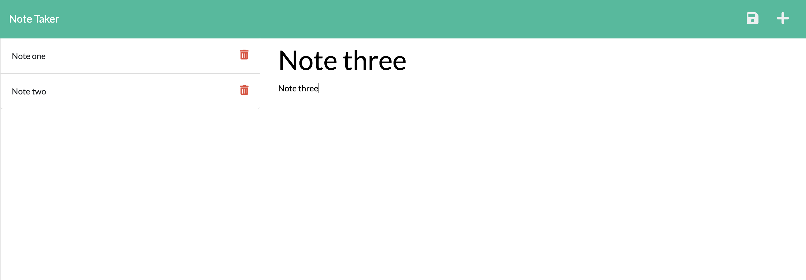

# Note Taker

This application allows the user to create, store and delete their notes. A list of the notes are displayed for access.

## Screenshots

## Application Link

[Note Taker](https://note-taker-project-wtg.herokuapp.com/) 

## Lessons Learned

This project required the implementation of Express.js and an understanding of the methods it uses in order to retreive and manipulate data.
Heroku was used to deploy the application.

## Authors

- [@taylorguenthner](https://www.github.com/wtguenthner)

